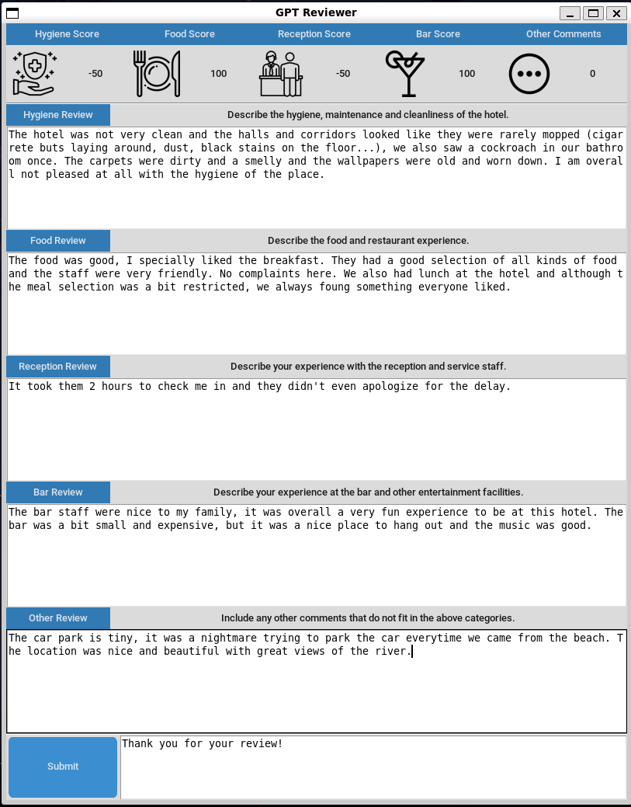
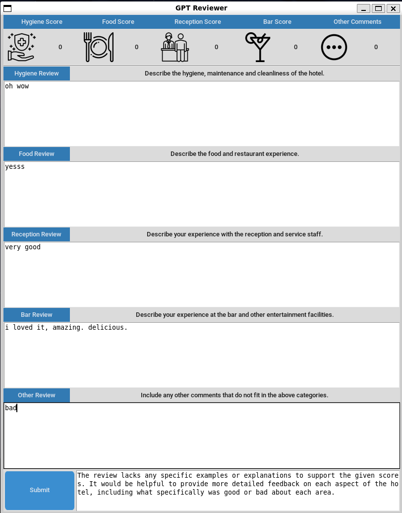

# :star: GPT-powered hotel review validator
This small project was made in 3 afternoons for the Digital Transformation of Processes course at my Master's. The objective was to perform a digital transformation of a hotel using modern technology and gamified systems. I decided to use GPT to drive this digital transformation, using mainly GPT3.5 and GPT4 when more reasoning power was needed.

The first step was to analyze the reviews of the hotel to find pain points and deficiencies in the hotel processes and customer touchpoints. It was discovered that the hotel had severe problems with its infrastructure and facilities, and so we set to creating a gamified system to fix it.

The objective is to create an internal gamification system in which all hotel employees can gather points by either completing tasks or getting positive reviews from customers. These points could then be redeemed for extra off days or salary increases.
Since creating the task completion monitoring system is a bit complex due to the differences among departments, we decided to just implement the feedback system from customer reviews, which they are incentivized to write by offering discounts.

Features:
- :speech_balloon: Analysis of 4500 reviews of a hotel using GPT to classify them according to the touchpoints mentioned, and also using traditional NLP techniques (lemmatization, stop word removal, etc.) to find the most relevant problems the hotel has.
- :mag: GPT-powered system that validates user-submitted reviews for quality assurance. GPT will automatically reject reviews that are too low-effort, and will also (try to) resist attempts to hijack it with prompt engineering.
- :ok_hand: GPT-powered system that evaluates how satisfied the user is with each touchpoint and awards points to them accordingly.
- :tv: Custom TKinter-based GUI for the review system, which shows how submitted reviews increase or decrease the score of the hotel employees/teams (hygiene, food, reception, bar and other). It also shows feedback to improve rejected reviews.

Files:
- "touchpoint_scoring.ipynb" contains all the code used to mine reviews for a hotel and detect the weakest customer touchpoint.
- "facilities_problems.ipynb" contains all the traditioanl NLP techniques used to extract what exactly were the problems with the hotel infrastructure. Spoiler: Just about everything.
- "gpt_reviewer.py" contains the backend code that validates and scored reviews using GPT.
- "gpt_reviewer_gui.py" contains the GUI in which you can write reviews and see how they affect the scores.

A screenshot of the GUI when a valid review is submitted:

A screenshot of the GUI when an invalid review is submitted:

Thanks to Flaticon (https://www.flaticon.com/) for providing the free icons used in the application.
